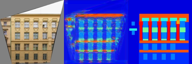
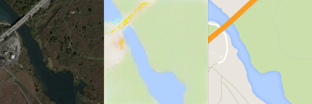

# Welcome to Caffe64!

We got sick and tired of complicated dependency wrangling and code bloat, and
set out to make the simplest and smallest, yet remarkably functional, neural
network library. 

## Requirements

Try our simple 3-item checklist to see if you're ready to upgrade to Caffe64.
* Are you using 64 bit linux on an Intel or AMD processor made after 2006? 
(Try `grep sse3 /proc/cpuinfo`)
* Does your system have `/dev/urandom`?
* Do you have 12KB or more disk space?

If so, you're set!

## Why make a new library?

Installing a new neural network library is typically a tremendous pain because
of onerous dependencies, python version hell, complicated Makefiles, and
massive code bloat. We've decided to ditch all of this and release a library
that we think is the **easiest to compile and most lightweight neural network
library, period**.

We've took a *radical* look at the dependencies and found that every single
piece of external code, from python to MKL to even the C standard library can
be safely ditched. All you need is a system that responds to the x86_64 syscall ABI and a
processor that supports SSE (up to SSE3 which is like ~10 years old).
If your system doesn't provide `/dev/urandom`, you'll also need a workaround (see FAQ). But
other than that, there literally no dependencies!

## Getting Started

If you've used caffe before, you'll feel right at home. Let's make caffe64!

    make
    gcc -o caffe64 caffe64.s -nostdlib
    strip caffe64

Wasn't that easy and fast!? On my machine it takes ~11ms. It's so fast that you could even run this in the inner loop of an RL algorithm!

    wc -c caffe64
    11368 caffe64

That's tiny (especially since it's a *static* executable)!

## Training with Caffe64

But does it work? Let's train a fully connected network to solve mnist!
First, download MNIST. 

    make data
    cd mnist && python dl.py
    --2018-03-12 12:51:30--  http://yann.lecun.com/exdb/mnist//train-images-idx3-ubyte.gz
    Resolving yann.lecun.com (yann.lecun.com)... 216.165.22.6
    Connecting to yann.lecun.com (yann.lecun.com)|216.165.22.6|:80... connected.

Now train a classification network to solve the task.

    make clsTrain
	./caffe64 train mnist/network5.txt netWeights/weights.bin mnist/optimsetting.txt 60000 mnist/mnistX.txt mnist/mnistYn.txt
       ______        ____ ____         _____  __ __
      / ____/____ _ / __// __/___     / ___/ / // /
     / /    / __ `// /_ / /_ / _ \   / __ \ / // /_
    / /___ / /_/ // __// __//  __/  / /_/ //__  __/
    \____/ \__,_//_/  /_/   \___/   \____/   /_/
    Parsing net...
    Loading X...
    Loading Y...
    [Training] Epoch 01 / 15 MBIter 020 / 600 LR 0.001000 Loss 1.983744
    [Training] Epoch 01 / 15 MBIter 040 / 600 LR 0.001000 Loss 1.351138
    [Training] Epoch 01 / 15 MBIter 060 / 600 LR 0.001000 Loss 0.759121
    [Training] Epoch 01 / 15 MBIter 080 / 600 LR 0.001000 Loss 0.607508
    [Training] Epoch 01 / 15 MBIter 100 / 600 LR 0.001000 Loss 0.489394
    [Training] Epoch 01 / 15 MBIter 120 / 600 LR 0.001000 Loss 0.468066
    [Training] Epoch 01 / 15 MBIter 140 / 600 LR 0.001000 Loss 0.400611
    ...
    Finished normally in 144s

If you've ever used caffe before you can probably guess at what each of these files does. But let's look at them to see.

    cat mnist/network5.txt
    5
    inp 784 100
    lin 100 -2
    rel
    lin 10 -2
    sce

This defines a 5 layer network that takes a 784 dimensional input in
minibatches of 100. It then runs it through a 100-channel linear layer that's
initialized with gaussian ~ N(0,10^-2). That's passed through a relu, and then
to a linear layer that outputs 10 channels, also initialized to ~N(0,10^-2).
This is then passed through a softmax-cross-entropy layer that defines a loss.

    cat mnist/optimsetting.txt
    0.001
    5
    0.1
    0.00001
    0.9
    15

These are just the parameters the optimizer uses to fit the net to data.

* Base learning rate
* LR epoch step count 
* LR drop factor
* Weight decay multiplier
* Momentum gamma
* Num epochs to run

The remaining inputs are ordinary data text files for the inputs (trainX.txt) and outputs (trainY.txt) and caffe64 dumps the weights to an easy to load binary format. 

Let's try it on test data!

    make clsTest
	./caffe64 test mnist/network5.txt netWeights/weights.bin 10000 mnist/mnistXe.txt mnist/p.txt
       ______        ____ ____         _____  __ __
      / ____/____ _ / __// __/___     / ___/ / // /
     / /    / __ `// /_ / /_ / _ \   / __ \ / // /_
    / /___ / /_/ // __// __//  __/  / /_/ //__  __/
    \____/ \__,_//_/  /_/   \___/   \____/   /_/
    Parsing net...
    Loading net...
    Loading X...
    [Testing] Epoch 1 / 1 MBIter 020 / 100
    [Testing] Epoch 1 / 1 MBIter 040 / 100
    [Testing] Epoch 1 / 1 MBIter 060 / 100
    [Testing] Epoch 1 / 1 MBIter 080 / 100
    [Testing] Epoch 1 / 1 MBIter 100 / 100
    Finished normally in 2s

Now the test posteriors have been written to mnist/p.txt!

You can find a regression network in mnist/networkReg.txt and other
networks in the examples `facades`, `rank`, and `image_reco`. 
Currently, caffe64 supports:
* An input layer (`inp`, which must be first and which must specify the feature
size and minibatch size)
* Linear layers (`lin`, which must specify the number of channels and initialization)
* Relu layers (`rel`)
* Tanh layers (`tnh`)
* Softmax layers (`smx`) 
* Softmax cross-entropy loss layers (`sce`), which can cap a network and do both softmax and cross-entropy
* L2 loss layers (`l2l`), which can cap a network.

## Writing new layers

Writing new layers in Caffe64 is easy. You need to:
* Add a new layer id and layer name
* Write initialization, forward, and backward functions
* Add the id, name, and functions to the call table

Layers themselves are easy to code -- here is the relu forward pass,
which uses a convenience macro to look up the previous layer in the
network and some constants for the offsets within the layer.

    reluForward:
        /* given a relu layer pointed to in rdi, do the forward pass */
        push rbx
        mov rbx, rdi
        prevLayerToRAXtRCX
        mov rsi, [rax+LAYER_OFF_DAT]
        mov rdi, [rbx+LAYER_OFF_DAT]
        mov rcx, [rbx+LAYER_OFF_N]
        imul rcx, [rbx+LAYER_OFF_K]

        pxor xmm1, xmm1
    1:  movss xmm0, [rsi]
        maxss xmm0, xmm1 
        movss [rdi], xmm0
        add rsi, 4
        add rdi, 4
        sub rcx, 1
        jnz 1b

        pop rbx
        ret

## But I don't want to program in assembly!

It's easy to use caffe64 even if your assembly skills are rusty. We provide
examples of calling caffe64 from python ( `image_reco`, `bridges`, `char` ) and
from MATLAB ( `facades` , `rank` ) using the timeless interface of writing to text
files, calling an executable, and reading from text files.

### Image reconstruction 

Here, you can use caffe64 to do a questionable image compression scheme where you
map (x,y) in the image to (r,g,b). Take a look at `image_reco.py` to get started.
Credit goes to Andrej Karpathy for doing this with
convnet.js. We provide two networks that yield slightly different styles.
See `image_reco/image_reco.py`.

 

### Facade prediction

Here, we use caffe64 to do the hard work and MATLAB to do im2col. Run `dl.sh` to
get the CMP facade database and then `facades/pix2pix64.m` to learn mappings from images to labels
and back. 

 

 

### Rank Estimation

Here, we do the classic WTF-is-your-problem task of predicting the rank of a matrix.
See `rank/doRank.m`, which generates matrix rank data and then trains a network and
then evaluates it.

### Bridges of Allegheny County

Here, we do a standard problem from the UCI repository and fit a logistic
regression model to predict properties of bridges in Pittsburgh from various
attributes. See `bridges/bridges.py`

### Character markov model

See `char` for a basic markov model over characters. Running it on caffe64.s 
lets us sample stuff like this (a particularly nice sample cherry picked).

    mov rdi, r13
    mov r12, [rbp-8]
    mov edx, 1

    mov rax, [rbx+layer_off_n]
    mov rdi, [rbx+layer_off_n]
    mov rsi, [currentn]
    mov rdx, [rbx+layer_off_k], r15

    mov r15, rsi

    mov rdi, [rdi+8*rax]
    mov edx, 1
    syscall
    mov rax, [rdi+4*rax]
    call rax
    mov rdi, r14

We can also sample paper ideas by learning a model on the CMU paper title database.

* interaction and bayesian graph for continuous data based on submodular factorization of perspective: a study for analysis
* learning from metametric and recurrent model automated optimization
* social low-rank representations
* matrix sets and learning as stochastic segmentation

## FAQ

**Q.** Is it hardcoded?

**A.** No, run the demos. We do six tasks with a variety of networks:
[1](facades/networkRegDeep.txt)
[2](char/charnet_base.txt)
[3](image_reco/networkRegDeep.txt)
[4](image_reco/networkReg.txt)
[5](mnist/network5.txt)
[6](mnist/networkReg.txt)
[7](rank/ranknet.txt)
[8](bridges/bridgenet_base.txt)

**Q.** What's the input format?

**A.** Caffe64 expects files to be written in ordinary, not scientific-notation, float
or int format (i.e., "%f" not "%e").

**Q.** It seems that it only does 1D feature vectors?

**A.** Convolution and other inductive biases are only necessary when you have small data! 

**Q.** Did you use a compiler or something?

**A.** No, that wouldn't be fun. For proof, just look at the register usage.

**Q.** Is it faster?

**A.** Probably faster than a naive implementation in C, but most of the computation is probably
spent in matrix multiplies, and I don't expect to be able to beat ATLAS at writing gemm.

**Q.** I don't have `/dev/urandom`, but I do have a recent processor. What's the workaround?

**A.**  Sure. Try `grep rdrand /proc/cpuinfo`. If you find it, replace `randbytes` with:

    randbytes:
        rdrand rax
        jnc randbytes
        ret

**Q.** What are the calling conventions?

**A.** It's the basically the usual [System V AMD64 ABI](https://en.wikipedia.org/wiki/X86_calling_conventions#System_V_AMD64_ABI): 
(1) arguments go in `rdi`, `rsi`, `rdx`, `rcx`, `r8`, `r9` for ints 
and the low scalar part of `xmm0`, ..., `xmm8` for floats, and
(2) callee saves are `rbx`, `rbp`, and `r12`, ..., `r15`. The exceptions
are that (1) some i/o procedures (e.g., `printInt`) save `rdi`
as a convenience for repeated calls and (2) we ignore all stack alignment stuff.

## Contributor List

* David Fouhey wrote caffe64 and the demos.
* Daniel Maturana made MNIST download way better and contributed a large dataset of paper titles that appear in the `char` demo.
* Your name can be here!

